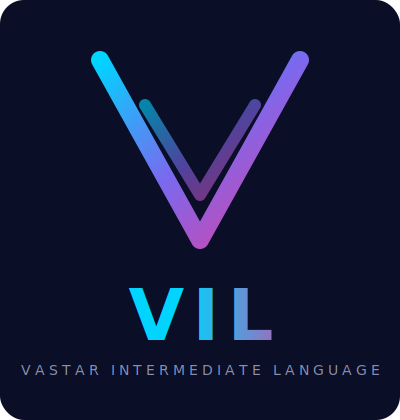

<p align="center">
  <picture>
    <source media="(prefers-color-scheme: dark)" srcset="docs/assets/vil-logo-dark.svg"/>
    <source media="(prefers-color-scheme: light)" srcset="docs/assets/vil-logo-light.svg"/>
    
  </picture>
</p>

<h1 align="center">VIL — Vastar Intermediate Language</h1>

<p align="center">
  A <strong>process-oriented language and framework</strong> hosted on Rust for building zero-copy, high-performance distributed systems.
</p>

<p align="center">
  <a href="LICENSE-MIT"></a>
  
  
  
  
</p>

VIL combines a **semantic language layer** (compiler, IR, macros, codegen) with a **server framework** (VilApp, ServiceProcess, Tri-Lane mesh) — generating all plumbing so developers write only business logic and intent.

```
Developer writes:          VIL generates:
  body: ShmSlice         →  Zero-copy request body via ExchangeHeap
  ctx: ServiceCtx        →  Tri-Lane inter-service messaging
  vil_workflow!           →  Process registration, port wiring, queue plumbing
  .transform(|line|{})   →  Per-record NDJSON/SSE inline processing
  VilResponse::ok(data)  →  SIMD JSON serialization + SHM write-through
```

## Key Differentiators

- **Zero-copy by default** — ShmSlice body extraction, ExchangeHeap, no intermediate buffers
- **Tri-Lane Protocol** — Trigger / Data / Control physically separated (no head-of-line blocking)
- **3 execution modes** — Native Rust (0 overhead), WASM sandbox (~1-5μs), Sidecar any language (~12μs)
- **YAML → Native binary** — write in Python/Go/Java/TypeScript/C#/Kotlin/Swift/Zig, compile to Rust binary (transpile SDK)
- **51 AI plugin crates + 30 connector/trigger crates** — LLM, RAG, Agent, embeddings, vector DB — all use VIL Way patterns
- **5 SSE dialects** — OpenAI, Anthropic, Ollama, Cohere, Gemini with correct done-signal handling
- **Production config** — profiles (dev/staging/prod), 30+ env vars, SHM pool P99 tuning

## Performance

> Intel i9-11900F (8C/16T), 32GB RAM, Ubuntu 22.04, Rust 1.93.1

| Benchmark | Throughput | records/s | P50 | P99 | Notes |
|-----------|-----------|-----------|-----|-----|-------|
| VX_APP HTTP server | **41,000 req/s** | — | 0.5ms | 26ms | Pure VIL overhead <1ms |
| AI Gateway (SSE proxy) | **6,200 req/s** | — | 76ms | 116ms | Sweet spot c500, 16% overhead vs direct |
| NDJSON transform (1K rec/req) | **895 req/s** | **895K rec/s** | 183ms | 246ms | Parse + enrich/filter + re-serialize |
| Multi-pipeline (shared SHM) | **3,700 req/s** | — | 46ms | 85ms | ShmToken zero-copy cross-workflow |

### AI Gateway (001) — Scaling & Overhead (validated 2026-03-27)

| Concurrent | Via VIL | Direct (simulator) | VIL Overhead | P50 | P99 | Success |
|-----------|---------|-------------------|--------------|-----|-----|---------|
| 100 | 2,111 | — | — | 43ms | 83ms | 100% |
| 200 | 3,875 | 4,734 | 18% | 45ms | 77ms | 100% |
| 300 | 5,780 | — | — | 46ms | 71ms | 100% |
| **400** | **6,466** | — | — | **56ms** | **88ms** | **100%** |
| **500** | **6,519** | 7,785 | **16%** | **72ms** | **112ms** | **100%** |
| 600 | 6,195 | — | — | 91ms | 120ms | 100% |
| 800 | 6,065 | — | — | 123ms | 186ms | 100% |
| 1000 | 6,239 | — | — | 152ms | 189ms | 100% |

**Sweet spot: c400-500 — ~6,500 req/s, P99 <112ms, 16% overhead vs direct.**
Throughput plateaus at c500+ while latency climbs. At c800+ P99 approaches 200ms SLO.

**What this means:** If you build a custom API gateway or data pipeline using VIL, you can expect performance in the same class as dedicated infrastructure software:

| Use Case | VIL Measured | Comparable To |
|----------|-------------|---------------|
| Custom REST gateway (routing + auth + transform) | **~41,000 req/s** | Envoy, Nginx reverse proxy |
| AI inference proxy (SSE streaming + Tri-Lane) | **~6,500 req/s** | Kong, AWS API Gateway (single node) |
| NDJSON data pipeline (parse + enrich + validate) | **~895 req/s (895K rec/s)** | Kafka Streams, Flink per-record transform |
| Multi-service mesh (Tri-Lane SHM) | **~3,700 req/s** | Service mesh sidecar (Linkerd, Istio dataplane) |

The difference: Envoy/Nginx are C/C++ infrastructure with no business logic. VIL delivers similar throughput **while executing your custom business logic** (validation, enrichment, routing decisions) inside the pipeline — not just proxying bytes.

Full benchmark with overhead analysis: [examples/BENCHMARK_REPORT.md](examples/BENCHMARK_REPORT.md)

## Quick Start

### Pattern A: HTTP Server (VX_APP)

```rust
use vil_server::prelude::*;

async fn create_task(ctx: ServiceCtx, body: ShmSlice) -> Result<VilResponse<Task>, VilError> {
    let store = ctx.state::<Arc<Store>>()?;
    let input: CreateTask = body.json().map_err(|_| VilError::bad_request("invalid JSON"))?;
    Ok(VilResponse::created(store.insert(input)))
}

#[tokio::main]
async fn main() {
    VilApp::new("tasks")
        .port(8080)
        .profile("prod")
        .service(ServiceProcess::new("tasks")
            .state(store)
            .endpoint(Method::POST, "/tasks", post(create_task)))
        .run().await;
}
```

### Pattern B: Streaming Pipeline (SDK)

```rust
use vil_sdk::prelude::*;

let source = HttpSourceBuilder::new("CreditIngest")
    .url("http://core-banking:18081/api/v1/credits/ndjson?page_size=1000")
    .format(HttpFormat::NDJSON)
    .transform(|line: &[u8]| {
        let r: serde_json::Value = serde_json::from_slice(line).ok()?;
        if r["kolektabilitas"].as_u64()? >= 3 { Some(line.to_vec()) } else { None }
    });

let (_ir, handles) = vil_workflow! {
    name: "NplFilter",
    instances: [sink, source],
    routes: [
        sink.trigger_out -> source.trigger_in (LoanWrite),
        source.data_out  -> sink.data_in      (LoanWrite),
        source.ctrl_out  -> sink.ctrl_in      (Copy),
    ]
};
```

### Pattern C: Custom Code (3 Execution Modes)

```yaml
# Native Rust — compiled in, 0 overhead
endpoints:
  - method: POST
    path: /api/enrich
    handler: enrich_handler
    exec_class: AsyncTask

# WASM — sandboxed, hot-deployable
vil_wasm:
  - name: pricing
    wasm_path: ./wasm-modules/pricing.wasm
    pool_size: 4
    functions:
      - name: calculate_price

# Sidecar — any language (Python, Go, Java)
sidecars:
  - name: ml-scorer
    command: python3
    script: ./sidecars/ml_scorer.py
    methods: [predict, score_batch]
    auto_restart: true
```

### Pattern D: Write in Python, Compile to Native Binary

```python
from vil import VilPipeline

pipeline = VilPipeline("ai-gateway", port=3080)
pipeline.sink(port=3080, path="/trigger")
pipeline.source(url="http://ai-provider:4545/v1/chat", format="sse")
# vil compile --from python --input gateway.py --release → native binary
```

## What's Inside

| Layer | Crates | Purpose |
|-------|--------|---------|
| **Runtime** | vil_types, vil_shm, vil_queue, vil_registry, vil_rt | Zero-copy SHM, SPSC queues, ownership registry |
| **Compiler** | vil_ir, vil_validate, vil_macros, vil_codegen_* | Semantic IR, 10 validation passes, code generation |
| **Server** | vil_server (9 crates) | VilApp, Tri-Lane mesh, 21 middleware, auth, config profiles |
| **Protocol** | vil_grpc, vil_graphql, vil_mq_kafka/nats/mqtt | gRPC, GraphQL, Kafka, NATS, MQTT — all with Tri-Lane bridge |
| **Database** | vil_db_sqlx, vil_db_sea_orm, vil_db_redis, vil_db_semantic | SQLx, SeaORM, Redis, zero-cost semantic layer |
| **AI Plugins** | vil_llm, vil_rag, vil_agent + 48 more | LLM, RAG, Agent, embeddings, vector DB — 51 crates, VIL Way |
| **SDK** | vil_sdk, vil_plugin_sdk, vil_cli | Pipeline SDK, plugin interface, CLI tooling |
| **Execution** | vil_capsule, vil_sidecar | WASM sandbox, sidecar protocol (UDS + SHM) |
| **Storage** | vil_storage_s3, vil_storage_gcs, vil_storage_azure | S3/MinIO, GCS, Azure Blob — all with db_log! auto-emit |
| **Database+** | vil_db_mongo, vil_db_clickhouse, vil_db_dynamodb, + 4 more | MongoDB, ClickHouse, DynamoDB, Cassandra, TimescaleDB, Neo4j, Elasticsearch |
| **MQ+** | vil_mq_rabbitmq, vil_mq_sqs, vil_mq_pulsar, vil_mq_pubsub | RabbitMQ, SQS/SNS, Pulsar, Pub/Sub — all with mq_log! |
| **Protocol+** | vil_soap, vil_opcua, vil_modbus, vil_ws | SOAP/WSDL, OPC-UA, Modbus, WebSocket server |
| **Triggers** | vil_trigger_cron/fs/cdc/email/iot/evm/webhook | Cron, filesystem, CDC, email, IoT, blockchain, webhook |
| **Observability** | vil_log, vil_otel | Semantic log (4.5-6.2x faster than tracing), OpenTelemetry export |
| **Edge** | vil_edge_deploy | ARM64, ARMv7, RISC-V deployment profiles |
| **Connector Macros** | vil_connector_macros | Lightweight #[connector_fault/event/state] for all connectors |

**130+ crates** | **71 examples** | **9 SDK languages** | **6 Grafana dashboards**

## Examples (5 Tiers)

| Tier | Count | Pattern | Highlights |
|------|-------|---------|------------|
| **Basic** (001-038) | 38 | VX_APP + SDK | ShmSlice, ServiceCtx, WASM FaaS, sidecar, WebSocket, SSE |
| **Pipeline** (101-107) | 7 | Multi-pipeline | Fan-out, fan-in, diamond, multi-workflow, traced |
| **LLM** (201-206) | 6 | VX_APP + SDK | Chat, multi-model, tools, batch translate, decision routing |
| **RAG** (301-306) | 6 | VX_APP | Vector search, multi-source, hybrid, citation, guardrail |
| **Agent** (401-406) | 6 | VX_APP | Calculator, HTTP fetch, file review, CSV, ReAct, handler+SHM |
| **VIL Log** (501-509) | 9 | vil_log | Stdout, file, multi-drain, benchmark, tracing bridge, structured events, file drain bench, multi-thread, Phase 1 integration |

```bash
# Run any example
cargo run --release -p vil-basic-hello-server

# Pipeline examples require upstream simulators (for benchmarking & overhead measurement):
#   AI Endpoint:  https://github.com/Vastar-AI/ai-endpoint-simulator    (:4545)
#   Credit Data:  https://github.com/Vastar-AI/credit-data-simulator    (:18081)
cargo run --release -p vil-basic-credit-npl-filter
```

## The 10 Immutable Principles

1. **Everything is a Process** — identity, ports, failure domain
2. **Zero-Copy is a Contract** — VASI/PodLike, ExchangeHeap
3. **IR is the Truth** — macros are frontend, vil_ir is source of truth
4. **Generated Plumbing** — developers never write queue push/pop
5. **Safety Through Semantics** — type system + IR + validation passes
6. **Three Layout Profiles** — Flat, Relative, External
7. **Semantic Message Types** — `#[vil_state/event/fault/decision]`
8. **Tri-Lane Protocol** — Trigger / Data / Control (no head-of-line blocking)
9. **Ownership Transfer Model** — LoanWrite, LoanRead, PublishOffset, Copy
10. **Observable by Design** — `#[trace_hop]`, metrics auto-generated

## VIL Way — 100% Enforced

| VIL Pattern | Replaces | Benefit |
|-------------|----------|---------|
| `body: ShmSlice` | `Json<T>` | Zero-copy via ExchangeHeap |
| `ctx: ServiceCtx` | `Extension<T>` | Tri-Lane context + typed state |
| `body.json::<T>()` | `serde_json` | SIMD JSON (sonic-rs) |
| `VilResponse::ok(data)` | `Json(data)` | SIMD serialization + SHM write-through |
| `#[connector_fault]` | Plain enum errors | Auto Display, error_code(), kind(), is_retryable() |
| `#[connector_event]` | Ad-hoc structs | #[repr(C)], ≤192B, compile-time size guard |
| `#[connector_state]` | Manual metrics | Zero-init state, atomic-ready counters |

All 51 AI plugins + all 71 examples use these patterns. Zero `Extension<T>`, zero `Json<T>` extractors.

## Documentation

| Guide | File |
|-------|------|
| Architecture Overview | [docs/ARCHITECTURE_OVERVIEW.md](docs/ARCHITECTURE_OVERVIEW.md) |
| Design Principles | [docs/vil/VIL_CONCEPT.md](docs/vil/VIL_CONCEPT.md) |
| Custom Code (Native/WASM/Sidecar) | [docs/vil/CUSTOM_CODE_GUIDE.md](docs/vil/CUSTOM_CODE_GUIDE.md) |
| VIL Guide (7 parts) | [docs/vil/001-VIL-Developer_Guide-Overview.md](docs/vil/001-VIL-Developer_Guide-Overview.md) |
| Server Framework | [docs/vil-server/vil-server-guide.md](docs/vil-server/vil-server-guide.md) |
| API Reference | [docs/vil-server/API-REFERENCE-SERVER.md](docs/vil-server/API-REFERENCE-SERVER.md) |
| Config Reference | [vil-server.reference.yaml](vil-server.reference.yaml) |
| LLM Knowledge Base | [llm_knowledge/](llm_knowledge/index.md) |
| Semantic Log System | [docs/vil/007-VIL-Developer_Guide-Semantic-Log.md](docs/vil/007-VIL-Developer_Guide-Semantic-Log.md) |
| Roadmap | [ROADMAP.md](ROADMAP.md) |

## Editor Support

`vil-lsp` provides diagnostics, completions, and hover for VIL macros alongside `rust-analyzer`.

| Editor | Setup |
|--------|-------|
| VS Code | [editors/vscode/](editors/vscode/) |
| Zed | [editors/zed/](editors/zed/) |
| Helix | [editors/helix/](editors/helix/) |
| JetBrains | [editors/jetbrains/](editors/jetbrains/) |

## License

Licensed under either of [Apache License 2.0](LICENSE-APACHE) or [MIT License](LICENSE-MIT) at your option.

## Links

- **Repository:** [github.com/OceanOS-id/VIL](https://github.com/OceanOS-id/VIL)
- **AI Endpoint Simulator:** [github.com/Vastar-AI/ai-endpoint-simulator](https://github.com/Vastar-AI/ai-endpoint-simulator)
- **Credit Data Simulator:** [github.com/Vastar-AI/credit-data-simulator](https://github.com/Vastar-AI/credit-data-simulator)
